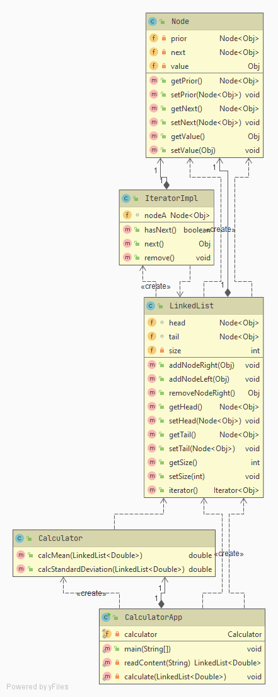
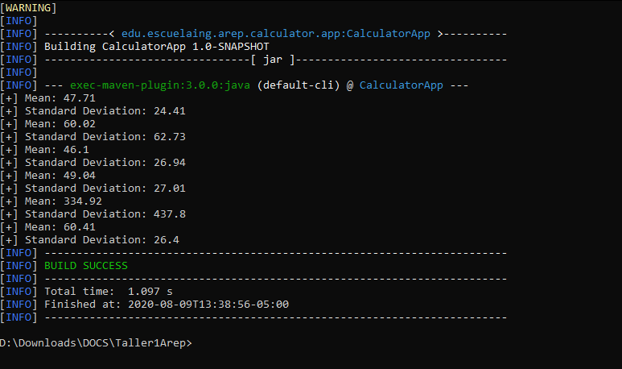
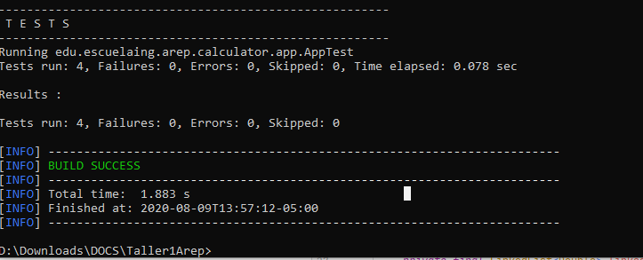
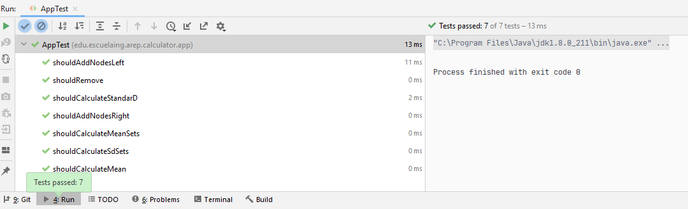
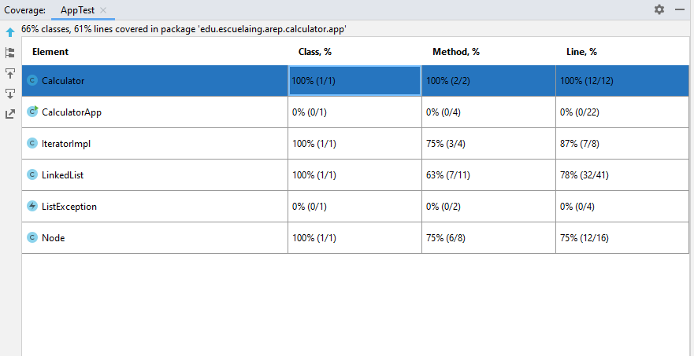

# Introduction to complex systems, JAVA, MVN, AND GIT

## Description

  This program calculates the mean and the standard deviation via manual implementation of LinkedLists.
 
## Design 

  This is the intended design for this project
  
  
  

## User's guide

  This is the guide that will setup this proyect at your local machine in order to be able to run it.
  
  ### Requisites
  
  It is necessary having these tools installed on your computer:
  
  * Maven 
  * Java 
  * Git
 
  ### Setting up
  
1. **Clone this repository:** 

    `git clone https://github.com/JohanS11/Taller1Arep.git`

2. **Build the project with maven:**
  
    `cd Taller1Arep && mvn package`

3. **Execute the project with maven:**

    `mvn exec:java -Dexec.mainClass="edu.escuelaing.arep.calculator.app.CalculatorApp" -Dexec.args=" DataTest\\dataSet.txt`

    In order to test with another text file you have to add it to the folder "DataTest" and modify the below command with
    the name of the txt file:   **"-Dexec.args="DataTest\\\yourtextfile.txt"** (**NOTE:** The values have to be separated by      comma).
    
    Now you will see the mean and the standard deviation for the set of values:
    
    
  
   ### Executing tests
   
     In order to run the tests developed with JUnit you have run the follow command:
   
     `mnv test`
      
     And you'll get an output like this:
     
     
     
     
     
     ### Tests coverage
     
     
     
  ## This project was built with:
  
   - Apache Maven 3.6.3
   - Java 1.8.0_211
   - Git 2.26.2
    
  ## Java Documentation
  
  In order to get additional information about this project you can use JavaDoc to get the Documentation.
  The documentation of this project is located in the folder **JavaDoc** at the root of this project.
  
  ## Author
  
  Johan Sebastian Arias Amador ([JohanS11](https://github.com/JohanS11))
  
  ## License
  
  This project is licensed under the GNU General Public License v3.0 - see the [LICENSE](https://github.com/JohanS11/Taller1Arep/blob/master/LICENSE) file for more details.
  
 
  
    
    
    
     
      
      
   
      
      
    
    
 

